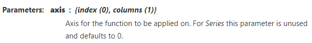

## Description
Return the sum of the values over the requested axis.

## Return
Series or DataFrame (if level specified).

## Reference link
* https://pandas.pydata.org/pandas-docs/stable/reference/api/pandas.DataFrame.sum.html
* https://blog.csdn.net/weixin_45144170/article/details/107695228

## Explanation of the axis parameter:

* axis=0 means to sum data in different rows, so the result is you will get sum data for each column
* axis=1 means to sum data in different columns, so the result is you will get sum data for each row
